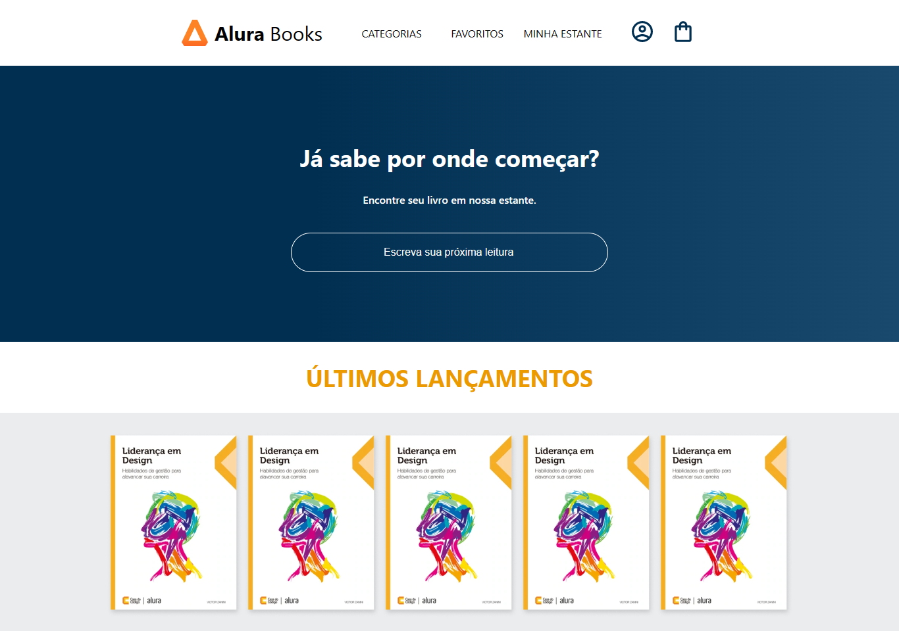

# Alura Books

O Alura Books é uma aplicação desenvolvida no curso <a href="https://cursos.alura.com.br/course/react-crie-primeira-pagina-web" target="_blank">React: crie sua primeira página web</a>. 
Foi pensado para:
- Compreenda os conhecimentos básicos teóricos e práticos de React
- Aplique a manutenção numa aplicação React
- Crie um website próprio usando React
- Coloque em prática as ferramentas mais utilizadas pelo mercado de trabalho front-end

## 🔨 Funcionalidades do projeto

Você pode passear <a href="https://www.figma.com/file/sSMbIqKaGBd66Y8roxTk2p/AluraBooks?node-id=37%3A94&t=1nTYLVq8bknK6sXL-0" target="_blank">no figma</a> para entender a arte conceitual do projeto.

## ✔️ Técnicas e tecnologias utilizadas

Se liga nessa lista de tudo que usaremos nessa formação:

- `React`
- `React Hooks`
- `Styled Components`
- `Props`

E muito mais!

## 🛠️ Abrir e rodar o projeto

Para abrir e rodar o projeto, execute `npm i` para instalar as dependências e `npm start` para inicar o projeto.

Depois, acesse <a href="http://localhost:3000/">http://localhost:3000/</a> no seu navegador.
